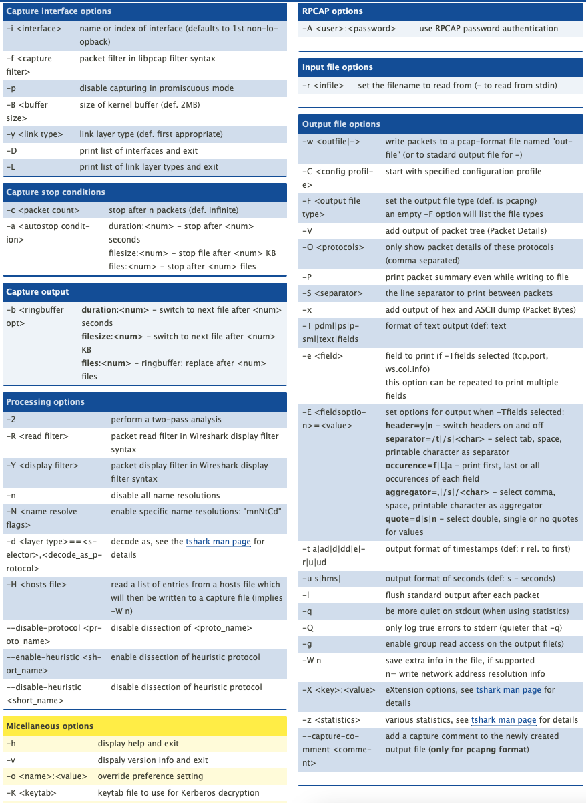

# tshark

## List unique source/destination IP addresses in pcap:

```bash
tshark -r capture.pcap -T fields -e ip.src | sort -u
tshark -r capture.pcap -T fields -e ip.dst | sort -u
```

## Capture to a PCAP

```jsx
tshark -i eth0 -w capture.pcap
```

## CheatSheets

(covered in ads) [tshark - Wireshark Command Line Cheat Sheet](https://cheatography.com/mbwalker/cheat-sheets/tshark-wireshark-command-line/)

<figure><figcaption></figcaption></figure>
