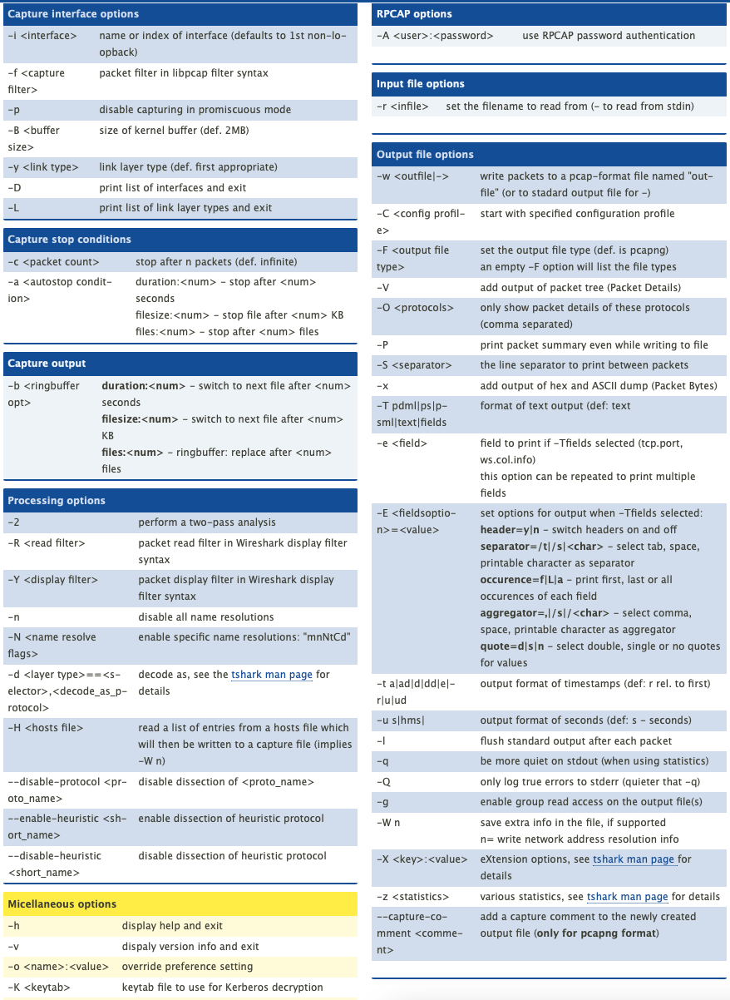

# tshark

TShark is the command-line version of Wireshark. It's essential for network traffic analysis during penetration tests, especially for credential extraction, protocol analysis, and identifying malicious traffic patterns.

## Basic Packet Capture

### Capture to a PCAP

```bash
tshark -i eth0 -w capture.pcap
```

### Capture with Filters

```bash
# Capture only HTTP traffic
tshark -i eth0 -f "tcp port 80" -w http_capture.pcap

# Capture traffic to/from specific host
tshark -i eth0 -f "host 10.10.10.123" -w host_capture.pcap

# Capture SMB traffic
tshark -i eth0 -f "tcp port 445 or tcp port 139" -w smb_capture.pcap
```

## Traffic Analysis

### List Unique Source/Destination IP Addresses

```bash
tshark -r capture.pcap -T fields -e ip.src | sort -u
tshark -r capture.pcap -T fields -e ip.dst | sort -u
```

### Extract HTTP Credentials


```bash
# Extract HTTP basic auth credentials
tshark -r capture.pcap -Y "http.authbasic" -T fields -e http.authbasic

# Extract HTTP POST data (potential credentials)
tshark -r capture.pcap -Y "http.request.method == POST" -T fields -e http.file_data

# Display HTTP requests with full URLs
tshark -r capture.pcap -Y "http.request" -T fields -e ip.src -e http.host -e http.request.uri
```


### Extract FTP Credentials

```bash
# FTP usernames
tshark -r capture.pcap -Y "ftp.request.command == USER" -T fields -e ftp.request.arg

# FTP passwords
tshark -r capture.pcap -Y "ftp.request.command == PASS" -T fields -e ftp.request.arg
```

### Extract SMB/NTLM Information


```bash
# Extract NTLM challenges and responses
tshark -r capture.pcap -Y "ntlmssp" -T fields -e ntlmssp.auth.username -e ntlmssp.auth.domain -e ntlmssp.auth.ntlmserverchallenge

# Extract SMB file operations
tshark -r capture.pcap -Y "smb2.filename" -T fields -e smb2.filename

# Extract SMB share names
tshark -r capture.pcap -Y "smb2.tree" -T fields -e smb2.tree
```


### Extract DNS Queries

```bash
# List all DNS queries
tshark -r capture.pcap -Y "dns.qry.name" -T fields -e dns.qry.name | sort -u

# Find DNS queries to suspicious domains
tshark -r capture.pcap -Y "dns.qry.name contains \".ru\" or dns.qry.name contains \".cn\"" -T fields -e dns.qry.name
```

### Kerberos Ticket Extraction

```bash
# Extract Kerberos service names
tshark -r capture.pcap -Y "kerberos.SName" -T fields -e kerberos.SName

# Extract Kerberos realm/domain
tshark -r capture.pcap -Y "kerberos.realm" -T fields -e kerberos.realm
```

### Extract Email Addresses

```bash
# Extract SMTP email addresses
tshark -r capture.pcap -Y "smtp" -T fields -e smtp.req.parameter | grep -Eo '\b[A-Za-z0-9._%+-]+@[A-Za-z0-9.-]+\.[A-Z|a-z]{2,}\b'
```

### SSL/TLS Certificate Information

```bash
# Extract SSL certificate common names
tshark -r capture.pcap -Y "ssl.handshake.certificate" -T fields -e x509sat.printableString
```

## Protocol-Specific Filters

### Common Display Filters

```bash
# Show only specific protocols
tshark -r capture.pcap -Y "http"
tshark -r capture.pcap -Y "smb2"
tshark -r capture.pcap -Y "ldap"
tshark -r capture.pcap -Y "kerberos"

# Show conversations between two hosts
tshark -r capture.pcap -Y "ip.addr == 10.10.10.123 && ip.addr == 10.10.10.124"

# Show failed authentication attempts
tshark -r capture.pcap -Y "ntlmssp.messagetype == 0x00000003 && ntlmssp.auth.username"
```

## Statistics and Summaries

### Protocol Hierarchy

```bash
tshark -r capture.pcap -q -z io,phs
```

### Conversation Statistics

```bash
# IP conversations
tshark -r capture.pcap -q -z conv,ip

# TCP conversations
tshark -r capture.pcap -q -z conv,tcp
```

### Endpoint Statistics

```bash
tshark -r capture.pcap -q -z endpoints,ip
```

## CheatSheets

(covered in ads) [tshark - Wireshark Command Line Cheat Sheet](https://cheatography.com/mbwalker/cheat-sheets/tshark-wireshark-command-line/)

<figure><figcaption></figcaption></figure>
