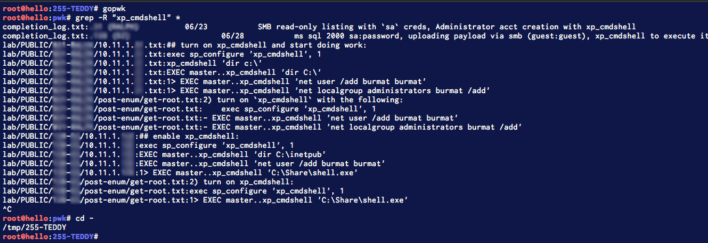

# OSCP / PWK - Random Tips and Tricks

## NOTE-TAKING

Taking great and **meaningful** notes is one the most important parts of the PWK lab experience and the OSCP exam. Below are the useful things I did to make my experience better and more educational. I mainly used Sublime and raw text files but the general structure, applications, and rules can be tweaked using your favorite text editor or note taker. I used the following structure for PWK but eventually transitioned over to using [Cherrytree](https://www.giuspen.com/cherrytree/). I recommend finding something like Cherrytree early-on and get accustomed to it, as it makes exporting your documents much easier.

### Shared Folder to VM?

People say that sharing folders with virtual machines comes with a certain amount of risk, but I have found it to be a necessary evil. I'm not going to address any of that here and instead am going to suggest that you go elsewhere to read up on the risks of sharing things like folders, devices, and clipboards with VM's.

With that said, I use it extensively for the pure reason that my VM's come and go like cheap Mexican food.  Making sure that you have a central repository to store your information in case of a VM failure or just to share across multiple VM's can be hugely beneficial to keeping your code, notes, and software centralized.  Doing so can help prevent code fragmentation, versioning conflicts, and accidental deletion.


**BACK EVERYTHING UP REGULARLY**. If you follow what I did, you have now introduced a single point of failure.  Use regular backup cycles to protect yourself from things like HDD corruption on the host system.  Keep your shit safe!


### Your Project's Folder Structure

Now that you have a place to keep your stuff, it's time to figure out how you want to lay it out. On the shared drive, I usually have a `code/` folder as well as a `software/` folder. You might see them referenced going forward. `code/` is a place I keep random scripts and exploit code, while `software/` is a place where I clone repositories and install software. Using aliases to go directly to them makes it incredibly easy to navigate to them and do work:

```bash
root@hello:~# pwd 
/root 

# my alias:
root@hello:~# gocode 

root@hello:code# ./dosomething.py 
something 

# go back:
root@hello:code# cd - 
/root
```

Using aliases is key to not having to `cd /to/that/long/share/path/`. I will touch more on them in a bit..

#### PWK File Structure

Let's get into what I developed and fine-tuned in the months I spent doing PWK. This is an outline of my directory structure:

```text
pwk/
├── connection/
│   └── OS-39215-PWK.ovpn
|
├── docs/
│   ├── OS-39215 Course Material.pdf
│   └── OS-39215 Lab Exercise Report.pdf
|
├── exercises/
│   ├── 1.1.1-dns-zone-transfer.sh
│   ├── 2.2.1-ips.txt
│   └── etc...
|
└── lab/
    ├── completion_log.txt
    ├── crendentials.txt
    ├── passwords.txt
    ├── unames.txt
    └── PUBLIC/
        └── 255-TEDDY/
        	├── 10.1.1.255.txt
        	├── exploit.sh
        	└──  post-enum/
				├── get-root.txt
				└── hashdump.txt
```

You probably are looking at that and going "screw that", and that's 100% fine. But if you are still with me, let me assure you that there **is** a point to all of this.  Let's talk about what I'm doing here:

* I'm keeping my documents and exercises in separate subdirectories but all within `pwk/`
* My `lab/` directory has a few files in the root of it, before dropping into the `PUBLIC/` directory. These files were **incredibly** important, and I will refer to them as "_Global Files_" when I outline their use in the next portion
* `PUBLIC/` represents a subnet within PWK. By the end of the lab, you should have an `ADMIN/` and an `IT/` directory as well.
* Within the subnet directory \(`PUBLIC/`\), I have another folder that is named after the last octet of the IP address and the hostname. This denotes a machine I am attacking. **Everything** related to this machine is under this directory.
* Within it, I have a `<ip address>.txt` file. This is my  "notes" file and will be a collection of everything I tried and thought.  In this directory, I also have **only relevant code** and files that helped lead to the exploitation of this machine.
* The `post-enum/` folder is where goodies/loot go. I might keep interesting files, network information, or hashdumps here, but the most important file in this folder is called `get-root.txt`. This is a "_1 - N steps to re-root the box_" and **I cannot stress how important this file was to me.**  There are many times you will need to go back to a box you have already rooted, and taking the time to scratch this together will save you countless hours when it happens.  Here is a sample of what that file might look like:

```text
1) start a reverse shell listener on port 443:
root@hello:255-TEDDY# nc -nvlp 443

2) go to the following url and login:
http://10.11.1.255:8080/manager/html/upload 	tomcat:tomcat

3) upload `burmat.war` using the "WAR file to deploy" feature

4) navigate to: http://10.11.1.255:8080/burmat
```

### Global Files

Remember those "_Global Files_" I mentioned up in the previous section?  Specifically, I am referring to these 4 files in my `lab/` directory:

* completion\_log.txt
* credentials.txt
* unames.txt
* passwords.txt

Let's go in order and I'll tell you what I use them for:

1. **completion\_log.txt** - This file is used to keep track of my progress. In this file, I put the IP and hostname of the machine, the date that I achieved root/SYSTEM on it, and a super broad explanation how I did so. For example: `.255 (TEDDY) 07/19 lfi on custom webapp, scheduled task overwrite`.  It's not incredibly specific, but with this information you might be able to remember the machine better. If you look here first, you can dive into your notes with a better understanding of what points are meaningful.
2. **credentials.txt** - This file will keep all of the credentials you find. Even it if is `admin:admin`,  you log it here. Here is a sample entry from my file: `admin:pass    # .255 (TEDDY) - http://10.11.1.255/admin/`. Similar to **completion\_log.txt**, this file is supposed to be broad, but also point you directly to something. You should be able to `grep` this file or look here for even the most basic logins for particular machines.  It also helps you locate where a given password was found. Which leads me into...
3. **unames.txt** and **passwords.txt** - These "_Global Files_" are your custom wordlists. Every time you find a username or a password, you append it to the corresponding file. You can then use these files if you need to brute things with `hydra` or other crackers. Password reuse **IS** a thing in PWK so make sure you take advantage of it from the start. I would recommend putting this list through something that will strip out the duplicates before cracking, as there is no reason to try the same password more than once \(`awk '!seen[$0]++' unames.txt && awk '!seen[$0]++' passwords.txt` should do it\). 

### Leveraging Your Notes

If you are still following along with me, that's great! Below are examples on how I leverage my project structure to find particular things and the reason for why I do what I do.

#### Using Aliases to Go Places

Aliases are incredible. Seriously. They make stupid commands less stupid, so learn how to leverage aliases now if you aren't.  I save all of my aliases to `/etc/profile.d/00-aliases.sh`.  Below are some of the ones I rely on pretty consistently:

```bash
#!/bin/bash

## will prevent the need of exiting/reopening terminal after adding an alias
refreshaliases='/etc/profile.d/00-aliases.sh'

## navigation
alias goshare='cd /mnt/hgfs/VMShare/'
alias gosoftware='cd /mnt/hgfs/VMShare/software/'
alias gocode='cd /mnt/hgfs/VMShare/code/'
alias godesktop='cd /root/Desktop/'
alias gopwk="cd /mnt/hgfs/VMShare/pwk/"
alias goexam="cd /mnt/hgfs/VMShare/pwk/exam/"
alias gopub="cd /mnt/hgfs/VMShare/pwk/lab/PUBLIC/"

## rdp to the offsec windows vm
alias offsecvm='rdesktop -u admin -p lab 192.168.23.111 -g 1366x768'
alias pwkconnect='openvpn /mnt/hgfs/VMShare/pwk/lab-connection/OS-39215-PWK.ovpn'

## a ssh tunnel i found myself having to use
alias proxy="echo password=Summer2018! && sshuttle -vr root@10.11.11.11 10.1.1.0/24"

## open a drag-to-select screenshot capture (mapped to hotkey)
alias sc='gnome-screenshot -ac'

## software:
alias nosqlmap='python /mnt/hgfs/VMShare/software/NoSQLMap/nosqlmap.py'
alias rsactftool='/mnt/hgfs/VMShare/software/RsaCtfTool/RsaCtfTool.py'
alias nfsshell="/mnt/hgfs/VMShare/software/nfsshell/nfsshell"
alias knock="/usr/bin/python3 /mnt/hgfs/VMShare/software/knock/knock"
# etc...

## mcd foldername - creates the folder and moves you into it. ty @brax <3
mcd () { mkdir -p $1; cd $1; }
```

You should hopefully understand at this point that the sky really is the limit. Annoyed with something? Make an alias.

#### Using \`grep\` to Find Things

Now you have aliases to move around and you have structured notes with all of your relevant content. How do you find things? Easy. 

For example:  Let's pretend I was working on a box and I have access to MS SQL but can't remember how to fully activate and leverage `xp_cmdshell`.  However, I remember activating and using `xp_cmdshell` on a prior lab machine. Running the following commands puts me in pretty good shape:

```bash
$ gopwk
$ grep -R "xp_cmdshell" *
$ cd -
```

I'm executing an alias to go to the root of my project folder, using `grep` to recursively search all files for a specific term \("_xp\_cmdshell"_\), and I'm going back to the machine directory I was in prior to running `gopwk`. This is a perfect summary of how all of what you just read ties together:



From this screenshot, I have everything I need to enable `xp_cmdshell` and create an administrator user "burmat". I also have clear indication on what boxes I have used this for and what their IP's are. I even have 2 records in the _**completion\_log.txt**_ file where I actively used this to elevate to SYSTEM.

## Logging Into PWK

This is just a collection of random hints, tips, and tricks that I learned or learned too late about PWK.

### Metasploit Framework / Meterpreter Use

I want to tackle this first, because it's usually the first thing that new lab attendees freak out about.  

I only used the Metasploit Framework and `meterpreter` payloads if I _**had**_ to. By the end of my ~55 days in the lab and the exam, I had rooted 30/50\(ish?\) machines and had low-privileged shells on about 5 more. I only did 1.5/4 of the "big-four" \(hard\) machines and I only had pivoted into one other subnet. I used MSF to launch a total of three exploits. Additionally, I only used full `meterpreter` payloads for post-enumeration \(to hasten hashdumps and search for loot off of flakey reverse shells\).  

I'm mentioning all of this because it's important to know that you don't HAVE to own every machine.  **This should not be your end goal or your measurement of success**.  It is more important to use this lab time as an opportunity to develop habits and a routine. It's more important to read the course material, try to find the machines within the lab that require the exploits mentioned, and exercise the vulnerability to understand it thoroughly. It's MOST important to understand WHY an attack is working and why it might not be. 

So what about Metasploit? It's restricted on the exam to only being used once. This is so that all of the things I just mentioned are actually factors when it comes exam time - you need to know your shit.  What I mean by that is, if you scan the network and find 10 hosts that are susceptible to EternalBlue \(MS17-010\), what do you do? Would you rather exploit that 10 times the same way, or continue scanning the host for more potential entry points? What about MS08-067?  This exploit is seen more than once in the lab as well, so would you rather learn how to manually exploit it  or fire MSF off at it to retrieve your shell?

Don't just jump through the easiest entry point. In the "real" world, sure, use the path of least resistance. But this isn't "real" world. This is a lab where you are expected to learn. When you see something with only SMB open, susceptible to MS17-010, and it's your only way in, maybe look up a blog post on it and alter some PoC code.  Building out the and tweaking exploits can be incredibly gratifying and will help build your arsenal moving forward. The harder the problem is, the greater the reward. Stop being so easy on yourself.

Use the opportunity \(you paid for\) to learn more about the exploits you are firing. That's all I'm saying.

### Bulk Scanning, Finding Victims

Figuring out the subnet is pretty easy with `route`, but now what? I would recommend scanning the entire subnet trying to find the DNS server. Once you have the DNS server, you can leverage it to get the hostnames on your scans as well: 

```bash
nmap --top-ports 10 --open --dns-server 10.11.1.??? -oA nmap/top10_all_hosts  10.11.1.0/24
```

I specifically mention this because it was something I never did until my final weeks. Had I started with this, I think I would have understood some of the relationships between the machines better. Additionally, it's a good way of finding the hard boxes \(the "big four"\) right away.

### Scanning Individual Systems

I'm not going to lie - PWK is slow at times. Sometimes your scans take a while and can slow you down. Firing scans off before lunch or before you get coffee is always a good idea, but I would instead recommend using [Sparta](https://sparta.secforce.com/). I stayed away from this tool because I thought it was an enumeration-crutch.  I'm a fucking idiot for thinking that.  

This tool will not only stage out your Nmap scans \(helps with the slower scans because results will trickle in for you to start hitting\), but it will run targeted NSE scripts against ports, `snmpwalk` for you, and run things like `nikto` on your behalf. I'm only naming a few of the features that make this tool great, but my favorite is that Sparta has the ability to save all of this information to a single workspace file, capable of being loaded back up in seconds.  This was a key piece to keeping my data organized, because often times I found myself leaving a host I was stuck on for days or weeks at a time.  Coming back to a nice cozy group of scan results is an absolute pleasure.

If you choose not to go this route, I would highly recommend that if you see HTTP\(s\) running on a port, scan it with Nikto. Every time. Nikto has picked up vulnerabilities that I would otherwise never would have found, so I cannot stress this enough.  

Additionally, if you don't do a full UDP scan, you should at least check port 161. If SNMP is open on a box, you should properly enumerate it. Every time. To scan this port, it's as easy as taking a few seconds and running: `nmap -p161 -sU -sV -sC 10.11.1.XX`, so you don't really have an excuse to not check this port.

## Exam Time!

So you worked your ass off to get here. The day has come to schedule your exam, and you are anxious but amped at the same time. Finally! This is where it all pays off!

### Picking Your Date

**If you know \(even roughly\) when you want to take the exam, schedule it immediately**. Offensive Security is nice enough to let you re-schedule a few times so you can always change the date.  I had a date picked out before I had even signed up for PWK, but missed my opportunity because I waited too long to schedule it. Don't make the same mistake I did if you know what you want!

If you don't know your when you want to schedule, no worries! Just plan it well-enough in advance and do what feels good to you. If you are 10 days away and don't feel ready, just bump it out a few more weeks.  I would recommend picking a start time that aligns with your normal routine. For example, I scheduled mine to start at 6AM because that is around the time that I am physically able to function \(I am not a morning person, so even this is pushing it\).  For me, I knew that if I closed my eyes, the exam was over. You will read other advice that says to sleep for a few hours, but I instead suggest that you should know yourself. I do, and I knew that sleeping was not an option for me.  If you don't know yourself well enough to make this call, take a trial run.  Grab 2-3 boxes from [VulnHub](https://www.vulnhub.com/) or login to [HackTheBox](https://www.hackthebox.eu/), and pretend like it is exam time. @abatchy [has a great post](https://www.abatchy.com/2017/02/oscp-like-vulnhub-vms) that has a few machines to consider.

### The Morning Of

Take a shower. Eat some cereal. Grab some coffee. Watch cartoons. Try to relax. Even the most relaxed people might not feel relaxed.  BREATHE. This is your chance to shine.

When the exam opens up, read every word the Offensive Security writes to you. Every email with the exam guidelines.

