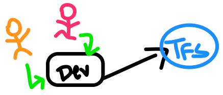

# Team Foundation Server Administration

## TFS AUTO-COMMIT

I'm quite new to TFS and revision control in general. Even with Git, I have only scratched the surface and don't know as much as I should. But I work with code a lot and I saw a need for it as more programmers were added to the team. Having revision control was important but the need was growing every day.  After standing up a TFS server to test and drumming up support, I was only let down because no one was utilizing it.

There is a design flaw in how code is written and tested. The code must be hosted and tested directly from the development server because there is a compiler service that must be the utility serving the HTTP responses. The code in this scenario is being deprecated, and although it is going to take a while, the hope is that this legacy code will eventually be replaced in a more modern programming language and development environment. But I'm not here to get into this problem, I want to share my solution.

Just because we can't check in/out the legacy code and use TFS to it's full capability, doesn't mean that we can't still use it to track revisions.  Getting a revision history is something that would help us with peer review and troubleshooting bad code. So I set out with the idea to make a PowerShell script to do just that for me.



I downloaded the PS snap-in from here:

#### [Microsoft Visual Studio Team Foundation Server 2015 Power Tools](https://marketplace.visualstudio.com/items?itemName=TFSPowerToolsTeam.MicrosoftVisualStudioTeamFoundationServer2015Power)


When installing, make sure you do a "Custom" install and manually select the PowerShell tools - it's not selected by default.


**Get Help With:** `Get-Command -Module Microsoft.TeamFoundation.PowerShell`

The first thing that I noticed was that I had a hard time finding official documentation on this snap-in. I am incredibly new to TFS, so I think that my understanding of how it works and terminology is not complete. Which leads me to:

#### **DISCLAIMER:**

* I thought that a "Project" in TFS-world was a repository. This understanding is incorrect, as a project can house multiple repositories within it. If you see this term sprinkled in the code, please disregard as I thought it was synonymous with "Repository" at the time of writing.
* One severe limitation right now is the fact that I am not handling any type of authentication. Because my domain user object is already authenticated with the TFS server, I do not have to worry about this problem right now. When I set up this script on another server, I will have to tackle it though and update this post with solutions I come up with.
* I'm am fresh with PowerShell so don't be hard on me. This was primarily written because I could not find many resources using the snap-in and I hoped to help a random person on the WWW. Please keep in mind that the latest revision will always be [on my Github](https://github.com/burmat/burmatscripts/blob/master/powershell/TFS-Commit.ps1)

With that said, my constraints for the script were:

* It does not have to track deleted files, but it must track new files and modified files
* It should be able to do and "initial" commit of an entire project folder, so anyone capable of reading and typing can set it up without having to modify code. 
* It will run nightly and commit the code directories you tell it to. No tricky logic - we can keep it dumb and simple.

#### **The script performs the following operations in this order:**

* Instantiate the TFS server object and create a workspace based on a TFS Project
  * Delete the directory if it exists, re-create it, and map the directory to the workspace
* Clone a copy of the project to the workspace
* Indiscriminately copy the development code from a file system location to the workspace folder and overwrite the contents.
* Use `Add-TfsPendingChange` to `-Add` or `-Edit` files, based on if they are already added to the workspace. 
  * If this is an initial commit \(`-FullCommit`\), the entire directory is staged with the `-Add` switch.
  * If `-FullCommit` is not used, it will only attempt to stage files that have been modified or added in the last 48 hours. Because this script runs nightly, this will signaficantly decrease the run time against large workspaces and still allow for a single nightly failure before potentially missing something.
* Commit all staged code

#### Resources:

If you landed here because you are trying to do something similar, make sure you also check out two posts that really helped me out.  This [post by Sergie Dorogin](https://techblog.dorogin.com/tfs-how-to-sync-a-server-folder-with-a-local-folder-considering-the-local-one-as-source-of-truth-9444419cd8ba) is good, but unfortunately I found it too late in the game when I was already almost finished. Don't make the same mistake I did! This [post by Malvin](https://malvinly.com/2013/06/19/syncing-tfs-with-a-local-directory/) was also incredibly useful to piece together some misconceptions of `Add-TfsPendingChange` that I had.

When getting started with the TFS snap-in, you are going to want to begin here:

```text
## instatiate the tfs server
$tfsServer = Get-TfsServer -Name $URL

## instatiate the version control server
$vcServer = $tfsServer.GetService([Microsoft.TeamFoundation.VersionControl.Client.VersionControlServer])

## instatiate the project
Try {
    $vcProject = $vcServer.GetTeamProject($PROJECT)
} Catch {
    Exit-WithError "Unable to find project with that name on TFS Server."
}
```

If you make it this far, you know that the TFS server is at least talking to you.  I found that it is easiest to just wipe away and start fresh with a new workspace. I could not find many good examples for situations like this where re-use of the workspace was offered up. All examples pointed to a solution similar to:

```text
## if the local directory exists, remove it
if (Test-Path -Path $LOCALFOLDER) {
    Print-Debug "Deleting local folder: $LOCALFOLDER"
    Remove-Item -Path "$LOCALFOLDER\*" -Recurse -Force | Out-Null
    Remove-Item -Path "$LOCALFOLDER" -Recurse -Force | Out-Null
    # yes i know it's twice - it's on purpose
}

## create the directory to house the workspace
New-Item -Path $LOCALFOLDER -Type Directory | Out-Null 

Try {
    ## try to find the workspace
    $workspace = $vcServer.GetWorkspace($WORKSPACENAME, $env:USERNAME)
    if ($workspace -ne $null) {
        Print-Debug "Workspace found, deleting it now.."
        $vcServer.DeleteWorkspace($WORKSPACENAME, $env:USERNAME) | Out-Null
    }
} Catch {
    Print-Debug "No workspace found."
}

## create the workspace, link to local directory
Print-Debug "Initializing workspace..."
$workspace = $vcServer.CreateWorkspace($WORKSPACENAME, $env:USERNAME)
$workspace.Map($SERVERPATH, $LOCALFOLDER)
```

I have two `Remove-Item` calls at the top of this snippet. For some reason, only running the second command \(`Remove-Item -Path "$LOCALFOLDER" -Recurse -Force | Out-Null`\) \***sometimes**\* doesn't delete the parent folder. The recommended StackOverflow answer was to use `-Recurse` inside of the directory \(`*`\) with a separate command to remove the directory itself. Random, I know. I just threw in another `-Recurse` for good measure. 

By the end of running something like this, you should have a valid workspace to commit from or clone to.  If files are not in the project already, you will have to use: `Add-TfsPendingChange -Add` to have the file staged for a commit. If the file is already in the project, you have to use: `Add-TfsPendingChange -Edit` to have modified files staged.  My first hope was to have both of these switches wrapped up into one. That would enable you to blindy stage things and not have to concern yourself further, because only that which has changed will be commited \(although this seems like a bad/lazy idea to have\). But that's not the case, so something like this will do the job:

```text
Try {
    $workspace = $vcServer.GetWorkspace($WORKSPACENAME, $env:USERNAME)
    if ($workspace -eq $null) {
        Exit-WithError "Workspace not initialized properly. Please re-initialize."
    }
} Catch {
    Exit-WithError "Unable to commit, workspace doesn't exist. Please re-initialize."
}

Print-Debug "Adding files to staging..."

## for every file in the workspace directory:
Get-ChildItem $LOCALFOLDER -Recurse | ForEach-Object { 

    $file = $_.FullName
    $isDir = Test-Path -Path $file -PathType Container

    if ($isDir -eq $False -And $file.contains('/$tf/') -eq $False){
     
        ## if flag given, add all files to staging
        if ($FullCommit) {
            Add-TfsPendingChange -Add -Item "$file" | Out-Null
        } else {
            ## only add files to staging if modified in last 48 hours
            if ($_.LastWriteTime -gt (Get-Date).AddDays(-2) -And $file.contains('*/$tf/*') -eq $False) {
                ## check if already in workspace and add if not
                $added = Get-TfsItemProperty -Item $file | Select -ExpandProperty IsInWorkspace
                if ($added) {
                    Add-TfsPendingChange -Edit -Item $file | Out-Null
                } else {
                    Add-TfsPendingChange -Add -Item "$file" | Out-Null
                }
            }
        }
    }
}
```

Keep in mind that I have a logical operation on line 25 that will only attempt to stage files that have been modified in the last 2 days. You might not want this, but I put this in to speed up the automated task I was running nightly. I blackhole the output from the commands because I like to look at the pending changes in the following manner \(just prior to firing the commit\):

```text
$pendingChanges = $workspace.GetPendingChanges()
if ($pendingChanges) {

    ## for logging purposes:
    Print-Debug "`n`nStaged files to commit:"
    $pendingChanges | fl FileName,ChangeType,ServerItem,CreationDate

    ## check in the code
    $Author = "POWERSHELL"
    $Comment = "*** AUTO COMMIT ***"
    if ($FullCommit) {
        $Comment = "Project Full Commit"
    }
    $policyOverrideInfo = New-Object Microsoft.TeamFoundation.VersionControl.Client.PolicyOverrideInfo("Auto checkin", $null)
    $checkinOptions = [Microsoft.TeamFoundation.VersionControl.Client.CheckinOptions]::SuppressEvent
    $workspace.CheckIn($pendingChanges, $Author, $Comment, $null, $null, $policyOverrideInfo, $checkinOptions)
    
    Print-Debug "`n`n---> Check-in Completed"

    ## you can check in file by file with: 
    ##  PS > New-TfsChangeset -Item "$LOCALFOLDER\burmatwashere.txt"" -Verbose -Override true

} else {
    Print-Debug "No files to check in"
}
```

As I stated above, [the full script can be found over at my GitHub](https://github.com/burmat/burmatscripts/blob/master/powershell/TFS-Commit.ps1). 

Moving forward, I will be adding in:

* Email of script output
* Authentication from a service account user
* Bulk run against all projects
* Handle deletions of files
* Exclude particular file types
* Copy only the project files that have been modified - this will dramatically increase the run time of the script. 

I hope this has helped someone, somewhere. It sure was a pain to even get this far so that was my only goal in writing all of this. I'll keep this script and page updated as I continue my journey forward with TFS with that hope in mind. 

### Manually Deleting Workspace via TFS PowerTools

I ended up accidentally running the script as a different user \(Administrator\) during a debugging session and locked up the workspace. Because the scheduled task was running as a different user but against the same workspace and directory structure, there was a conflict. I didn't discover this right away, but eventually I just logged in as the problem user and ran the following:

```text
## connect to the server and lookup the workspace. delete it.
PS C:\Users\burmat> Add-PSSnapin Microsoft.TeamFoundation.Powershell
PS C:\Users\burmat> $tfsServer = Get-TfsServer -Name http://coderepo.burmat.co:8080/tfs/Projects"
PS C:\Users\burmat> $vcServer = $tfsServer.GetService([Microsoft.TeamFoundation.VersionControl.Client.VersionControlSer
ver])
PS C:\Users\burmat> $vcProject = $vcServer.GetTeamProject("PROJECT1")
PS C:\Users\burmat> $workspace = $vcServer.GetWorkspace("TFS-PROJECT1", $env:USERNAME)
PS C:\Users\burmat> if ($workspace -ne $null) { Write-Host "FOUND WORKSPACE"; }
FOUND WORKSPACE
PS C:\Users\burmat> $vcServer.DeleteWorkspace("TFS-PROJECT1", $env:USERNAME)
True

## find it again and see if it still exists, you will find it does not:
PS C:\Users\burmat> $workspace = $vcServer.GetWorkspace("TFS-PROJECT1", $env:USERNAME)
Exception calling "GetWorkspace" with "2" argument(s): "TF14061: The workspace TFS-RISC1;Administrator does not exist."
At line:1 char:1
+ $workspace = $vcServer.GetWorkspace("TFS-RISC1", $env:USERNAME)
+ ~~~~~~~~~~~~~~~~~~~~~~~~~~~~~~~~~~~~~~~~~~~~~~~~~~~~~~~~~~~~~~~
    + CategoryInfo          : NotSpecified: (:) [], MethodInvocationException
    + FullyQualifiedErrorId : WorkspaceNotFoundException
```

